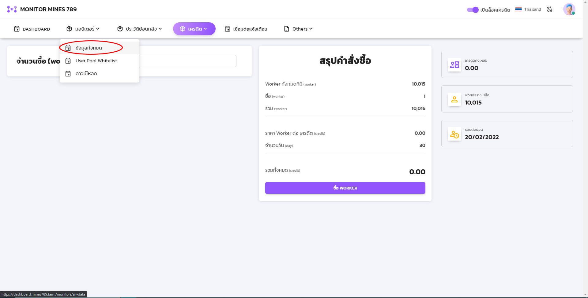

# Add worker to dashboard

## 1. ไปที่แถบ "มอนิเตอร์" แล้วเลือก "ข้อมูลทั้งหมด"

## 2. กดที่ "เพิ่มเครื่องขุด"

.jpg>)

## 3. กรอกข้อมูลเครื่องขุด

* กรอกชื่อเครื่อง ( ผู้ใช้สามารถตั้งชื่อไว้เรียกเองได้ )
* กรอก IP address โดยผู้ใช้ต้องใช้ Network เดียวกันกับ ASICs ที่ต้องการผูกข้อมูลกับ Dashboard ในการเชื่อมต่อครั้งแรก
* กรอกข้อมูล ยี่ห้อ / รุ่น /เหรียญ&#x20;
* กรอกสถานที่ตั้ง
* กรอก LAN ID โดยหากแต่ละเครื่องอยู่กันคนละ Network ต้องใช้ LAN ID ไม่เหมือนกัน

## 4. เปิดการแจ้งเตือนต่างๆ

* Line - เปิดการแจ้งเตือนผ่านไลน์
* Notification when ASICs Online/Offline - แจ้งเตือนเมื่อมีการเปิด/ปิด ASICs
* Notify Whitelist - แจ้งเตือนเมื่อมีการเปลี่ยน Pool ที่อยู่นอกเหนือ Whitelist

## 5. กดปุ่ม "เพิ่ม" หลังกรอกข้อมูลทั้งหมด

